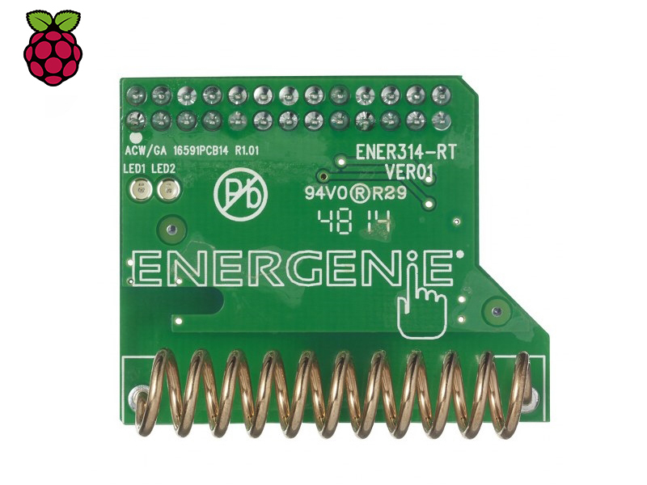
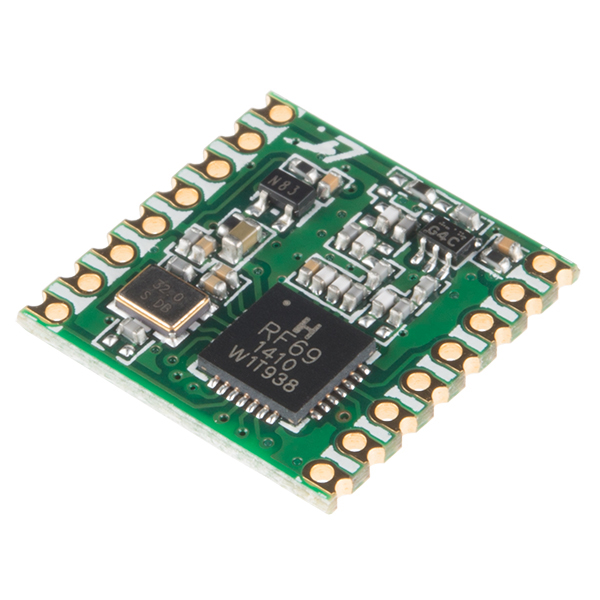
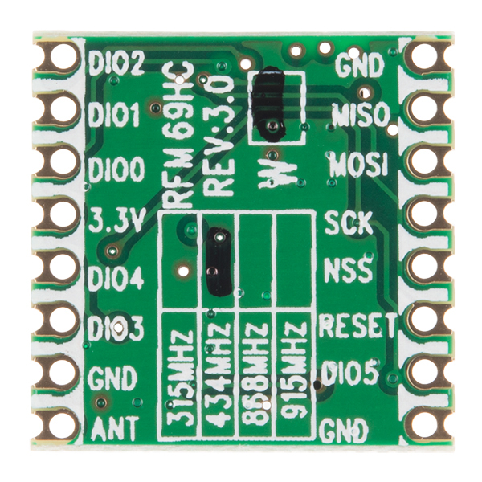

# Hardware

## Supported boards

### ENER314-RT Transmitter/Receiver for Raspberry Pi

### RFM69HCW  

 - Likely RFM12B boards
 - Likely RFM69CW boards (pin compatible with RFM12B)

## RFM69 Wiring pattern

|H RFM69|Raspberry Pi| Function |
| ---- | ---- | ---- |
|RESET|GPIO_BCM_25| Reset |
|MOSI|GPIO_BCM_10| Output |
|MISO|GPIO_BCM_9| Input |
|SCK|GPIO_BCM_11| Clock |
|NSS|GPIO_BCM_7| Interrupt/Device select|
|3.3V|3.3V| VCC |
|GND|GND| GND |

The Official Energenie board uses GPIO_BCM_7 (CE1) as the selector, and it is recommended to do the same if you are using your own board, as it will prevent confusion. However if you have already got a device
on GPIO_BCM_7 you can use GPIO_BCM_8 (CE0) but please bare this in mind when configuring the code.

Other software supporting the HRFM69 use the D0 pin attached to GPIO_BCM_25, it may be useful for those applications to attach that pin to another nearby available pin, but this is not required for our application.

**ENER314-RT Note**: The only real difference with the ENER314 is having a couple of LED's connected to another two incidental pins, personally I think this is unnecessary, but can also be built on your own custom board using GPIO 23 (receive), 24 (send).
